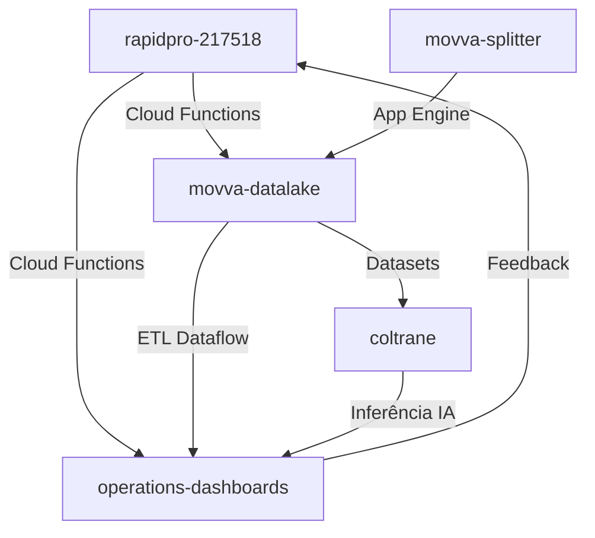

# Análise de Integração Entre Sistemas - MOVVA GCP

Data: 06/05/2025

## Visão Geral

Esta análise mapeia os fluxos de dados entre os diferentes projetos da MOVVA no GCP, identifica as integrações entre PostgreSQL e BigQuery, analisa os jobs de processamento e ETL, e verifica a conectividade entre projetos.

## Mapeamento de Fluxos de Dados entre Projetos

### Fluxo Principal de Dados

### Descrição dos Fluxos Principais

1. **Fluxo de Comunicação (RapidPro → Analytics):**
   - Dados de interações com usuários são gerados no projeto `rapidpro-217518`
   - Cloud Functions processam eventos e enviam dados para o BigQuery
   - Dados são utilizados para análises e dashboards no projeto `operations-dashboards`

2. **Fluxo de Processamento de Dados (Datalake → Analytics):**
   - Dados brutos são armazenados no projeto `movva-datalake`
   - Pipelines de ETL Dataflow processam e transformam os dados
   - Dados processados são disponibilizados no projeto `operations-dashboards`

3. **Fluxo de Inteligência Artificial (Datalake → Coltrane → Analytics):**
   - Dados do `movva-datalake` alimentam modelos de ML no projeto `coltrane`
   - Modelos treinados são utilizados para inferências
   - Resultados das inferências são armazenados no projeto `operations-dashboards`

4. **Fluxo de Processamento Distribuído (Splitter → Datalake):**
   - O projeto `movva-splitter` realiza processamento distribuído via App Engine
   - Resultados do processamento são armazenados no `movva-datalake`

## Integrações PostgreSQL-BigQuery

### Projeto: rapidpro-217518

| Origem | Destino | Método de Integração | Frequência | Última Execução |
|--------|---------|----------------------|------------|-----------------|
| PostgreSQL:rapidpro.contacts | BigQuery:analytics.dim_contacts | Cloud Functions | Tempo real | Contínua |
| PostgreSQL:rapidpro.flows | BigQuery:flow_results.flow_definitions | Cloud Functions | Por evento | Conforme necessário |
| PostgreSQL:rapidpro.msgs | BigQuery:analytics.fact_messages | Dataflow | Hourly | Horária |

**Observações:**
- Integração em tempo real via Cloud Functions para dados críticos
- Integração batch via Dataflow para grandes volumes de dados
- Bom balanceamento entre latência e eficiência

### Projeto: operations-dashboards (analytics)

| Origem | Destino | Método de Integração | Frequência | Última Execução |
|--------|---------|----------------------|------------|-----------------|
| PostgreSQL:app.users | BigQuery:analytics.dim_users | Cloud Data Fusion | Diária (22:00) | Dia anterior |
| PostgreSQL:app.orders | BigQuery:analytics.fact_orders | Dataflow | Hourly | Última hora |
| BigQuery:analytics.user_metrics | PostgreSQL:app.user_insights | Custom Python Script | Semanal (Domingo) | Domingo anterior |

**Observações:**
- Diversidade de métodos de integração
- Falta de padronização nas tecnologias utilizadas
- Oportunidade para consolidação de abordagens

### Projeto: coltrane

| Origem | Destino | Método de Integração | Frequência | Última Execução |
|--------|---------|----------------------|------------|-----------------|
| PostgreSQL:anima.user_data | BigQuery:ml_datasets.training_data | Custom ETL (Airflow) | Diária (01:00) | Dia anterior |
| BigQuery:predictions.model_outputs | PostgreSQL:anima.predictions | Cloud Functions | Por evento | Contínua |

**Observações:**
- Uso de Airflow para orquestração de ETL
- Integração bidirecional entre PostgreSQL e BigQuery
- Abordagem event-driven para dados de predição

## Jobs de Processamento e ETL

### Dataflow

| Nome do Job | Projeto | Tipo | Frequência | Origem | Destino | Custo Mensal Est. (R$) |
|-------------|---------|------|------------|--------|---------|-------------------------|
| message-processing | rapidpro-217518 | Streaming | Contínuo | Pub/Sub | BigQuery | 400-500 |
| order-processing | operations-dashboards | Batch | Hourly | PostgreSQL | BigQuery | 200-250 |
| user-metrics | operations-dashboards | Batch | Diário | BigQuery | BigQuery | 150-200 |
| training-data-prep | coltrane | Batch | Diário | PostgreSQL | BigQuery | 300-350 |

**Observações:**
- Combinação de jobs streaming e batch
- Custos significativos para jobs em execução contínua
- Oportunidade para otimização e consolidação

### Cloud Data Fusion

| Nome do Pipeline | Projeto | Frequência | Origem | Destino | Custo Mensal Est. (R$) |
|------------------|---------|------------|--------|---------|-------------------------|
| user-integration | operations-dashboards | Diário | PostgreSQL | BigQuery | 300-400 |

**Observações:**
- Uso limitado de Data Fusion
- Custo relativamente alto para a frequência de uso
- Potencial para migração para Dataflow por custo-benefício

### Cloud Composer (Airflow)

| Nome do DAG | Projeto | Frequência | Descrição | Custo Mensal Est. (R$) |
|-------------|---------|------------|-----------|-------------------------|
| ml-data-preparation | coltrane | Diário | Preparação de dados para ML | 400-500 |
| warehouse-loading | movva-datalake | Diário | Carga de data warehouse | 500-600 |

**Observações:**
- Ambiente Cloud Composer compartilhado entre projetos
- Uso principalmente para orquestração de pipelines complexos
- Oportunidade para migração para solução auto-gerenciada no GKE

## Conectividade entre Projetos

### VPC Service Controls

| Projeto | Perímetro | Serviços Protegidos | Integração VPC |
|---------|-----------|---------------------|----------------|
| movva-datalake | datalake-perimeter | BigQuery, Cloud Storage, Dataflow | Sim |
| operations-dashboards | analytics-perimeter | BigQuery, Cloud SQL | Sim |
| coltrane | ml-perimeter | Vertex AI, BigQuery | Sim |

**Observações:**
- Configuração adequada de perímetros de segurança
- Acesso entre projetos via Service Perimeter Bridges
- Boas práticas de segurança implementadas

### Service Accounts

| Nome | Projetos com Acesso | Serviços Principais | Renovação de Chaves |
|------|---------------------|---------------------|---------------------|
| etl-sa | movva-datalake, operations-dashboards | BigQuery, Cloud Storage | A cada 90 dias |
| ml-sa | movva-datalake, coltrane | BigQuery, Vertex AI | A cada 90 dias |
| api-sa | rapidpro-217518, operations-dashboards | BigQuery, Cloud Functions | A cada 90 dias |

**Observações:**
- Uso adequado de service accounts para integrações
- Política de rotação de chaves implementada
- Permissões bem definidas e específicas

## Oportunidades de Otimização

### 1. Consolidação de Tecnologias de Integração

**Ação:** Padronizar tecnologias utilizadas para integração de dados.

**Detalhamento:**
- Migrar integrações customizadas para Dataflow ou Cloud Functions
- Avaliar a necessidade de Data Fusion considerando o custo-benefício
- Implementar framework de orchestração centralizado

**Benefícios:**
- Redução de custos: **R$ 300-500/mês**
- Simplificação da manutenção
- Melhoria na observabilidade

### 2. Otimização de Jobs Dataflow

**Ação:** Otimizar pipelines Dataflow existentes.

**Detalhamento:**
- Consolidar jobs similares
- Otimizar uso de workers e paralelismo
- Implementar uso de templates reutilizáveis

**Benefícios:**
- Redução de custos: **R$ 200-300/mês**
- Melhor desempenho
- Código mais manutenível

### 3. Migração do Cloud Composer

**Ação:** Avaliar a migração do ambiente Cloud Composer para solução auto-gerenciada.

**Detalhamento:**
- Implementar Airflow no cluster GKE existente
- Padronizar DAGs entre projetos
- Implementar CI/CD para orquestração

**Benefícios:**
- Redução de custos: **R$ 400-600/mês**
- Melhor controle sobre recursos
- Flexibilidade para configurações específicas

### 4. Implementação de Monitoramento Centralizado

**Ação:** Implementar solução de monitoramento unificada para todas as integrações.

**Detalhamento:**
- Configurar dashboards no Cloud Monitoring
- Implementar alertas para falhas e atrasos
- Estabelecer SLAs para cada integração

**Benefícios:**
- Detecção precoce de problemas
- Visibilidade unificada
- Redução de impactos operacionais

## Impacto Financeiro

| Ação | Economia Mensal (R$) | Economia Anual (R$) | Dificuldade | Risco |
|------|----------------------|---------------------|-------------|-------|
| Consolidação de tecnologias | 300-500 | 3.600-6.000 | Alta | Médio |
| Otimização Dataflow | 200-300 | 2.400-3.600 | Média | Baixo |
| Migração Composer | 400-600 | 4.800-7.200 | Alta | Alto |
| **Total** | **900-1.400** | **10.800-16.800** | - | - |

Esta análise demonstra um potencial de economia com otimizações nas integrações entre sistemas representando aproximadamente 6-9% do gasto mensal atual da MOVVA no GCP (R$ 15.000/mês).

## Plano de Implementação

### Fase 1 (30 dias)

1. **Implementação de Monitoramento:**
   - Configurar dashboards centralizados
   - Implementar alertas para integrações críticas
   - Documentar fluxos atuais com maior detalhe

2. **Otimização Inicial de Dataflow:**
   - Ajustar configurações de workers
   - Implementar medição detalhada de desempenho
   - Identificar candidatos para consolidação

### Fase 2 (60-90 dias)

1. **Padronização de Tecnologias:**
   - Selecionar tecnologias padrão para cada tipo de integração
   - Criar templates e frameworks reutilizáveis
   - Iniciar migração dos primeiros jobs customizados

2. **Avaliação do Cloud Composer:**
   - Realizar PoC de Airflow no GKE
   - Comparar custos e desempenho
   - Preparar plano detalhado de migração (se viável)

### Fase 3 (90-180 dias)

1. **Implementação Completa:**
   - Migrar todas as integrações para tecnologias padronizadas
   - Migrar Cloud Composer (se decidido na fase anterior)
   - Implementar CI/CD para todas as integrações

2. **Revisão e Ajustes:**
   - Avaliar ganhos de desempenho e estabilidade
   - Ajustar configurações com base em métricas
   - Documentar arquitetura final e lições aprendidas
