# Infraestrutura GCP Consolidada - MOVVA

Data: 12/05/2025

## Visão Geral

Este documento apresenta uma visão consolidada da infraestrutura da MOVVA no Google Cloud Platform, abrangendo todos os seis projetos principais, suas interconexões e recomendações de otimização.

**Período de Análise:** 01/04/2025 a 30/04/2025

Os dados de faturamento e uso de recursos apresentados neste documento foram obtidos a partir do BigQuery, dataset "faturamento" no projeto "rapidpro-217518", considerando o período acima.

## Diagrama de Infraestrutura

```mermaid
graph TD
    subgraph "Projeto: rapidpro-217518"
        RP_VMs[VMs: 3 instâncias
               - rapidpro-main
               - rapidpro-worker
               - rapidpro-redis]
        RP_SQL[Cloud SQL PostgreSQL
               100GB, Alta Disponibilidade]
        RP_AE[App Engine
              - API: Flexible
              - Frontend: Standard]
        RP_CS[Cloud Storage
              890GB em 4 buckets]
        RP_CF[Cloud Functions
              3 funções - 1ª Geração]
        RP_CR[Cloud Run
              2 serviços]
        RP_BQ[BigQuery
              1TB em 3 datasets]
    end

    subgraph "Projeto: movva-datalake"
        DL_VM[VMs: 10 instâncias
              Todas TERMINATED]
        DL_CS[Cloud Storage
               5.070GB em 8+ buckets]
        DL_CF[Cloud Functions
               2 funções - 1ª Geração]
        DL_BQ[BigQuery
               5.1TB em 3+ datasets]
        DL_AF[Cloud Composer/Airflow]
    end

    subgraph "Projeto: coltrane"
        CO_GKE[GKE
               1 cluster, 3 nós]
        CO_SQL[Cloud SQL PostgreSQL
                500GB, Alta Disponibilidade]
        CO_VAI[Vertex AI
                Notebooks e Endpoints]
        CO_BQ[BigQuery
               2.6TB em 3 datasets]
        CO_CF[Cloud Functions
               3 funções - 2ª Geração]
        CO_CR[Cloud Run
               4 serviços]
        CO_CS[Cloud Storage
               1.830GB em 4 buckets]
    end

    subgraph "Projeto: operations-dashboards"
        AN_BQ[BigQuery
               2TB em 3 datasets]
        AN_SQL[Cloud SQL PostgreSQL
                200GB, Sem HA]
        AN_GKE[GKE
                1 cluster, 2 nós]
        AN_CS[Cloud Storage
                650GB em 3 buckets]
        AN_CR[Cloud Run
                2 serviços]
        AN_DF[Dataflow/Data Fusion
                Pipelines de integração]
    end

    subgraph "Projeto: movva-splitter"
        SP_AE[App Engine
               1 serviço - Standard]
        SP_CS[Cloud Storage
                38GB em 4 buckets]
        SP_VM[VM: 1 instância
               TERMINATED]
    end

    subgraph "Projeto: movva-captcha"
        CA_RE[reCAPTCHA Enterprise]
    end

    %% Fluxos entre projetos
    RP_CF -->|Eventos| DL_BQ
    RP_CF -->|Mensagens| AN_BQ
    DL_BQ -->|Dados| AN_BQ
    DL_BQ -->|Datasets| CO_VAI
    SP_AE -->|Processamento| DL_CS
    CO_VAI -->|Inferência| AN_BQ
    AN_BQ -->|Insights| RP_SQL
    
    %% Relacionamentos internos
    RP_VMs --- RP_SQL
    RP_AE --- RP_SQL
    RP_CF --- RP_SQL
    DL_CF --- DL_CS
    DL_AF --- DL_BQ
    CO_GKE --- CO_VAI
    CO_SQL --- CO_VAI
    AN_GKE --- AN_DF
    AN_DF --- AN_BQ
    AN_SQL --- AN_DF
```

## Resumo de Recursos por Projeto

### 1. Projeto: rapidpro-217518

**Propósito:** Plataforma de comunicação e automação para campanhas via múltiplos canais.

**Recursos Principais:**
- **Computação:** 3 VMs ativas (e2-standard-4, e2-standard-2, e2-medium)
- **Serverless:** App Engine (API e Frontend), Cloud Run (2 serviços), Cloud Functions (3 funções)
- **Armazenamento:** Cloud Storage (890GB em 4 buckets)
- **Banco de Dados:** PostgreSQL (100GB, Alta Disponibilidade)
- **Analytics:** BigQuery (1TB em 3 datasets)

**Custo Mensal (bruto):** R$ 11.765,93
**Créditos Aplicados:** R$ 2.767,66
**Custo Mensal (líquido):** R$ 8.998,27 (66,11% do gasto líquido total)

### 2. Projeto: movva-datalake

**Propósito:** Processamento e armazenamento central de dados.

**Recursos Principais:**
- **Computação:** 10 VMs desligadas (várias configurações)
- **Serverless:** Cloud Functions (2 funções)
- **Armazenamento:** Cloud Storage (5.070GB em 8+ buckets)
- **Analytics:** BigQuery (5.1TB em 3+ datasets)
- **Orquestração:** Cloud Composer/Airflow

**Custo Mensal (bruto/líquido):** R$ 32,22 (0,24% do gasto líquido total)
**Créditos Aplicados:** R$ 0,00

### 3. Projeto: coltrane

**Propósito:** Serviços de IA e automação.

**Recursos Principais:**
- **Computação:** GKE (1 cluster, 3 nós e2-standard-4)
- **Serverless:** Cloud Run (4 serviços), Cloud Functions (3 funções - 2ª geração)
- **Armazenamento:** Cloud Storage (1.830GB em 4 buckets)
- **Banco de Dados:** PostgreSQL (500GB, Alta Disponibilidade)
- **Analytics:** BigQuery (2.6TB em 3 datasets)
- **IA:** Vertex AI (notebooks e endpoints)

**Custo Mensal (bruto):** R$ 2.744,40
**Créditos Aplicados:** R$ 686,92
**Custo Mensal (líquido):** R$ 2.057,48 (15,12% do gasto líquido total)

### 4. Projeto: operations-dashboards (analytics)

**Propósito:** Dashboards operacionais e análise de dados.

**Recursos Principais:**
- **Computação:** GKE (1 cluster, 2 nós e2-standard-2)
- **Serverless:** Cloud Run (2 serviços)
- **Armazenamento:** Cloud Storage (650GB em 3 buckets)
- **Banco de Dados:** PostgreSQL (200GB, sem Alta Disponibilidade)
- **Analytics:** BigQuery (2TB em 3 datasets)
- **Integração:** Dataflow e Data Fusion

**Custo Mensal (bruto):** R$ 2.704,33
**Créditos Aplicados:** R$ 53,49
**Custo Mensal (líquido):** R$ 2.650,84 (19,47% do gasto líquido total)

### 5. Projeto: movva-splitter

**Propósito:** Processamento distribuído usando App Engine.

**Recursos Principais:**
- **Computação:** 1 VM desligada (e2-small)
- **Serverless:** App Engine Standard (1 serviço)
- **Armazenamento:** Cloud Storage (38GB em 4 buckets)

**Custo Mensal (bruto/líquido):** R$ 12,01 (0,09% do gasto líquido total)
**Créditos Aplicados:** R$ 0,00

### 6. Projeto: movva-captcha-1698695351695

**Propósito:** Implementação do reCAPTCHA Enterprise.

**Recursos Principais:**
- **Segurança:** reCAPTCHA Enterprise API

**Custo Mensal:** Mínimo (< 1% do orçamento total)

## Resumo de Custos por Serviço (Consolidado)

| Serviço | Custo Mensal (R$) | % do Total | Projetos Principais |
|---------|-------------------|------------|---------------------|
| Cloud SQL | 9.890,00 | 57,51% | rapidpro-217518, coltrane |
| Compute Engine | 2.594,31 | 15,09% | operations-dashboards, rapidpro-217518 |
| Kubernetes Engine | 1.511,30 | 8,79% | rapidpro-217518 |
| Networking | 725,26 | 4,22% | rapidpro-217518, coltrane, operations-dashboards |
| App Engine | 691,10 | 4,02% | coltrane, rapidpro-217518 |
| BigQuery | 703,94 | 4,09% | operations-dashboards |
| Cloud Run | 648,19 | 3,77% | rapidpro-217518 |
| GKE Enterprise/GDC | 222,37 | 1,29% | rapidpro-217518 |
| Datastream | 103,34 | 0,60% | operations-dashboards |
| Cloud Storage | 72,51 | 0,42% | coltrane, movva-datalake |
| Secret Manager | 40,76 | 0,24% | coltrane, rapidpro-217518 |
| Outros serviços | 55,81 | 0,32% | Diversos projetos |

**Observação:** Os valores foram extraídos diretamente das tabelas `faturamento.evolutivo_gastos_transicao` e `faturamento.gcp_billing_export_resource_v1_017436_D221A3_C4D547` do BigQuery no período de 30/03/2025 a 12/05/2025.

**Custos Consolidados:**
- **Custo Bruto Total:** R$ 17.258,90
- **Créditos Aplicados:** R$ 3.508,07 (100% do tipo DISCOUNT)
- **Custo Líquido Total:** R$ 13.750,83

## Fluxos de Dados Principais

### 1. Fluxo de Comunicação
- Origem: `rapidpro-217518` (interações com usuários)
- Processamento: Cloud Functions para captura de eventos
- Destino: BigQuery nos projetos `rapidpro-217518` e `operations-dashboards`
- Uso: Análises, relatórios e dashboards

### 2. Fluxo de Dados Analíticos
- Origem: `movva-datalake` (dados brutos)
- Processamento: Dataflow, Cloud Composer
- Destino: BigQuery no projeto `operations-dashboards`
- Uso: Dashboards operacionais e análise avançada

### 3. Fluxo de Processamento de IA
- Fonte de Dados: `movva-datalake` e `rapidpro-217518`
- Processamento: `coltrane` (Vertex AI, modelos de ML)
- Resultado: BigQuery no projeto `operations-dashboards`
- Uso: Insights, previsões e automação

### 4. Fluxo de Feedback
- Origem: `operations-dashboards` (insights processados)
- Processamento: ETL customizado
- Destino: PostgreSQL no projeto `rapidpro-217518`
- Uso: Otimização de campanhas e personalização

## Recomendações de Otimização Consolidadas

Com base na análise atualizada da infraestrutura da MOVVA no GCP e nos dados de billing extraídos do BigQuery, identificamos um potencial de economia de **R$ 8.350-11.200/mês** (36-48% do gasto atual), distribuído nas seguintes categorias:

### 1. Otimização de Recursos Ociosos

**Economia potencial:** R$ 300-450/mês (1,3-1,9% do gasto atual)

**Ações principais:**
- Excluir VMs desligadas em projetos com baixo uso (R$ 150-200/mês)
- Remover versões de App Engine sem tráfego (R$ 100-150/mês)
- Limpar dados obsoletos em buckets (R$ 30-50/mês)
- Excluir discos não associados e snapshots antigos (R$ 20-50/mês)

**Dificuldade:** Baixa
**Risco:** Baixo

### 2. Otimização de BigQuery

**Economia potencial:** R$ 280-450/mês (1,2-1,9% do gasto atual)

**Ações principais:**
- Implementar particionamento e clustering em tabelas grandes (R$ 100-150/mês)
- Materializar views frequentemente consultadas (R$ 80-120/mês)
- Implementar BigQuery BI Engine (R$ 50-80/mês)
- Avaliar slot commitments (R$ 50-100/mês)

**Dificuldade:** Média
**Risco:** Baixo a Médio

### 3. Otimização de Cloud SQL

**Economia potencial:** R$ 4.800-6.200/mês (20,7-26,7% do gasto atual)

**Ações principais:**
- Redimensionar instâncias PostgreSQL, principalmente do rapidpro-217518 (R$ 3.500-4.500/mês)
- Otimizar políticas de backup e logs (R$ 600-800/mês)
- Implementar réplicas sob demanda (R$ 700-900/mês)

**Dificuldade:** Média a Alta
**Risco:** Médio

### 4. Otimização de Armazenamento

**Economia potencial:** R$ 30-50/mês (0,1-0,2% do gasto atual)

**Ações principais:**
- Implementar políticas de ciclo de vida em todos os buckets (R$ 15-25/mês)
- Compressão de dados para arquivos CSV, logs e backups (R$ 10-15/mês)
- Consolidação de buckets com propósitos semelhantes (R$ 5-10/mês)

**Dificuldade:** Baixa a Média
**Risco:** Baixo

### 5. Otimização de Computação

**Economia potencial:** R$ 2.550-3.700/mês (11-16% do gasto atual)

**Ações principais:**
- Implementar escalonamento para VMs do RapidPro (R$ 800-1.200/mês)
- Otimizar GKE com Spot Instances para workloads não críticas (R$ 600-800/mês)
- Otimizar configurações de Cloud Run (R$ 350-500/mês)
- Migrar Cloud Functions para 2ª geração (R$ 350-500/mês)
- Otimizar App Engine (R$ 450-700/mês)

**Dificuldade:** Média
**Risco:** Baixo a Médio

### 6. Otimização de Networking

**Economia potencial:** R$ 300-450/mês (1,3-1,9% do gasto atual)

**Ações principais:**
- Otimizar configurações de redes e regras de firewall (R$ 150-200/mês)
- Revisar uso de balão de carga e reduzir custos de tráfego (R$ 100-150/mês)
- Otimizar configurações de VPC (R$ 50-100/mês)

**Dificuldade:** Média
**Risco:** Médio

### 7. Otimização de App Engine e Cloud Run

**Economia potencial:** R$ 550-800/mês (2,4-3,4% do gasto atual)

**Ações principais:**
- Otimizar configurações de App Engine em coltrane (R$ 250-350/mês)
- Revisar e consolidar serviços Cloud Run em rapidpro-217518 (R$ 200-300/mês)
- Implementar escalonamento automático eficiente (R$ 100-150/mês)

**Dificuldade:** Alta
**Risco:** Médio a Alto

## Análise de Créditos

A análise dos dados de faturamento no BigQuery revelou que existem créditos significativos aplicados que reduzem o custo efetivo da infraestrutura. Abaixo está o detalhamento desses créditos:

### Distribuição de Créditos por Projeto

| Projeto | Valor dos Créditos (R$) | % do Total de Créditos |
|---------|---------------------------|---------------------------|
| rapidpro-217518 | 2.767,66 | 78,9% |
| coltrane | 686,92 | 19,6% |
| operations-dashboards | 53,49 | 1,5% |
| movva-datalake | 0,00 | 0,0% |
| movva-splitter | 0,00 | 0,0% |

### Impacto nos Custos

Os créditos aplicados representam aproximadamente 20,3% do custo bruto total, resultando em uma redução significativa no valor final pago. É importante considerar esses créditos ao avaliar o custo real da infraestrutura e ao planejar otimizações.

### Tipos de Créditos

Todos os créditos identificados são do tipo "DISCOUNT", que são descontos promocionais aplicados pela Google Cloud Platform. É importante monitorar a disponibilidade desses créditos ao longo do tempo, pois muitos são temporários e podem expirar, resultando em aumento dos custos líquidos.

## Problemas e Limitações Identificados

Durante a análise, identificamos os seguintes problemas e limitações que devem ser considerados:

### 1. Problemas de Permissão

- **APIs não habilitadas:** Cloud SQL Admin API não está habilitada em alguns projetos
- **Visualização limitada:** Falta acesso a métricas detalhadas de uso em alguns serviços
- **Restrições de acesso:** Acesso restrito a configurações específicas de segurança

### 2. Inconsistências nos Dados

- **Diferenças entre custos históricos e atuais:** Os dados de faturamento do mês de abril de 2025 do BigQuery (custo bruto de R$ 17.258,90 e líquido de R$ 13.750,83) diferem significativamente das estimativas anteriores
- **Possíveis recursos não mapeados:** Podem existir recursos adicionais não incluídos na análise
- **Dados incompletos de performance:** Falta de métricas históricas para otimização precisa

### 3. Considerações Técnicas

- **Dependências entre projetos:** Alterações em um projeto podem impactar outros
- **Riscos em migrações:** Especialmente para serviços críticos como bancos de dados
- **Lacunas de documentação:** Falta de documentação sobre alguns recursos e integrações

## Próximos Passos Recomendados

### Fase 1: Otimizações Imediatas (0-30 dias)

1. **Otimização de Cloud SQL (prioridade máxima):**
   - Analisar detalhadamente instâncias PostgreSQL em rapidpro-217518 
   - Revisar e ajustar configurações de instâncias SQL com alta disponibilidade
   - Implementar políticas de backup otimizadas
   - Avaliar alternações de tamanho das instâncias em períodos de baixa utilização

2. **Limpeza de recursos ociosos e otimização de computação:**
   - Excluir VMs desligadas nos projetos menores
   - Otimizar instâncias de Compute Engine em operations-dashboards
   - Analisar custos de Kubernetes Engine em rapidpro-217518

3. **Estabelecer governança:**
   - Implementar monitoramento de custos
   - Definir processo para provisionamento de novos recursos
   - Documentar arquitetura atual com maior detalhe

### Fase 2: Otimizações Estruturais (30-90 dias)

1. **Otimizações de App Engine e Cloud Run:**
   - Otimizar configurações de App Engine em coltrane
   - Revisar serviços Cloud Run em rapidpro-217518
   - Implementar ajustes de escalonamento automático

2. **Otimizações de Networking e BigQuery:**
   - Revisar e otimizar configurações de rede e regras de firewall
   - Implementar particionamento nas tabelas mais acessadas do BigQuery
   - Materializar views frequentemente consultadas

3. **Consolidação de abordagens:**
   - Padronizar tecnologias de integração
   - Consolidar buckets com propósitos semelhantes
   - Implementar padrões de nomenclatura

### Fase 3: Transformações Avançadas (90-180 dias)

1. **Otimizações de arquitetura e migrações:**
   - Avaliar migração de App Engine para Cloud Run onde aplicável
   - Implementar réplicas sob demanda para PostgreSQL
   - Consolidar serviços semelhantes entre projetos

2. **Otimizações avançadas e monitoramento contínuo:**
   - Analisar e otimizar gastos em Cloud SQL com base em dados de performance
   - Implementar slot commitments para BigQuery se aplicável
   - Estabelecer dashboard de monitoramento contínuo de custos

3. **Automação e eficiência contínua:**
   - Implementar scripts para provisionamento e limpeza automática
   - Estabelecer processo de revisão periódica
   - Desenvolver dashboards de eficiência de custos
   - Monitorar a aplicação de créditos e possíveis expirações de programas promocionais
   - Criar alertas para aumentos abruptos em categorias específicas de custo
