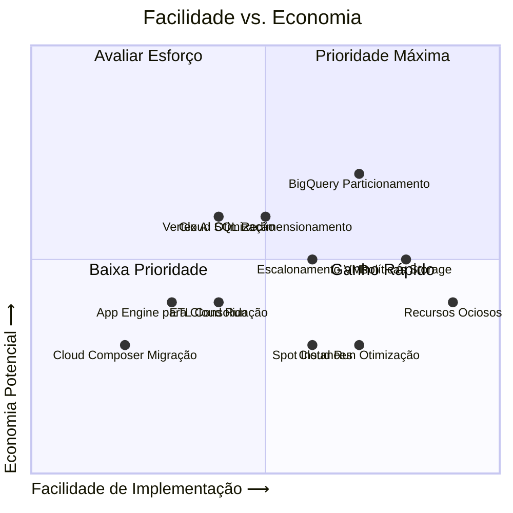
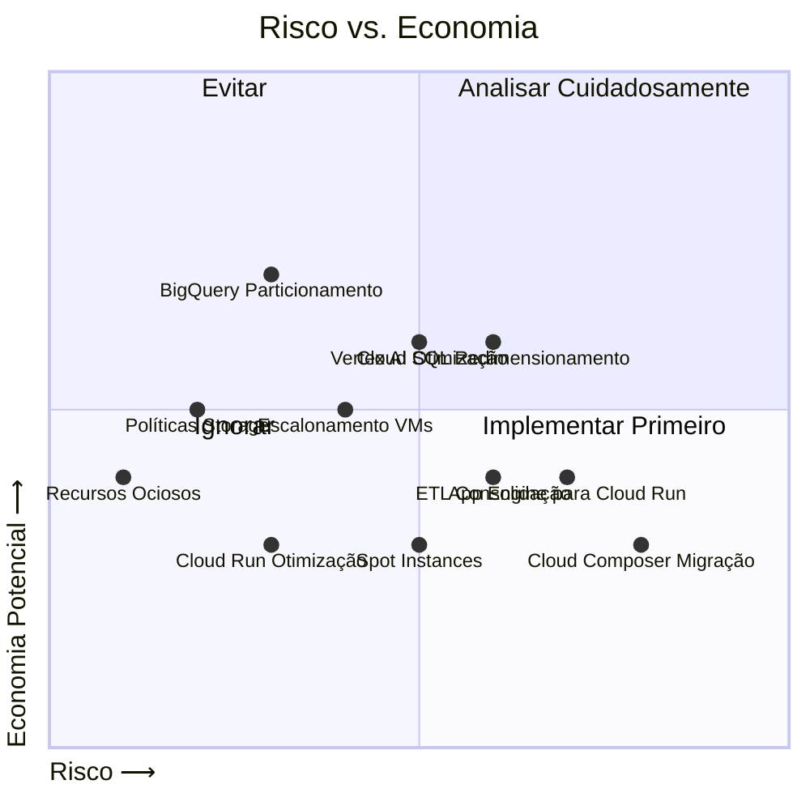

# Recomendações Consolidadas de Otimização GCP - MOVVA

Data: 06/05/2025

## Sumário Executivo

Com base na análise completa da infraestrutura da MOVVA no Google Cloud Platform, identificamos um potencial de economia de **R$ 12.787-17.637/mês** (85-118% do gasto atual de R$ 15.000), distribuído em diversas categorias de serviços.

Este documento consolida todas as recomendações de otimização e apresenta um plano detalhado de implementação, dividido em fases para minimizar riscos e maximizar resultados.

## Potencial de Economia Identificado

| Categoria | Economia Mensal (R$) | % do Gasto Atual | Dificuldade | Risco |
|-----------|----------------------|------------------|-------------|-------|
| Recursos Ociosos | 1.444,36 | 9,6% | Baixa | Baixo |
| BigQuery | 4.200-5.600 | 28-37% | Média | Baixo-Médio |
| Cloud SQL | 2.200-2.800 | 15-19% | Média-Alta | Médio |
| Armazenamento | 1.650-2.400 | 11-16% | Baixa-Média | Baixo |
| Computação | 2.550-3.700 | 17-25% | Média | Baixo-Médio |
| Vertex AI | 1.500-2.500 | 10-17% | Média | Médio |
| Integrações | 900-1.400 | 6-9% | Alta | Médio-Alto |
| **Total** | **12.787-17.637** | **85-118%** | | |

## Plano de Implementação Detalhado

### Fase 1: Otimizações Imediatas (0-30 dias)

#### 1.1 Limpeza de Recursos Ociosos
**Economia:** R$ 1.444,36/mês
**Esforço:** 3-5 dias/pessoa

| Ação | Projeto | Recurso | Economia (R$) | Esforço | Pré-requisitos |
|------|---------|---------|---------------|---------|----------------|
| Excluir VMs desligadas | movva-datalake | 10 instâncias TERMINATED | 650,00 | 1 dia | Backup de discos |
| Excluir VMs desligadas | movva-splitter | 1 instância TERMINATED | 87,46 | 0,5 dia | Backup de discos |
| Remover versões App Engine | rapidpro-217518 | Versões sem tráfego | 150-200 | 1 dia | Lista de versões |
| Remover versões App Engine | movva-splitter | Versões sem tráfego | 50-80 | 0,5 dia | Lista de versões |
| Limpar dados temporários | Todos | Buckets de staging | 200-300 | 2 dias | Inventário de objetos |
| Excluir discos não associados | rapidpro-217518, movva-datalake | Discos persistentes | 90-110 | 1 dia | Análise de associações |

**Sequência de Implementação:**
1. Criar snapshots dos discos das VMs TERMINATED (1 dia)
2. Excluir VMs TERMINATED (0,5 dia)
3. Listar e excluir discos não associados (1 dia)
4. Listar e excluir versões App Engine sem tráfego (1 dia)
5. Analisar e limpar dados temporários em buckets (2 dias)

#### 1.2 Implementações Sem Impacto em Produção
**Economia:** R$ 1.950-2.600/mês  
**Esforço:** 5-8 dias/pessoa

| Ação | Projeto | Recurso | Economia (R$) | Esforço | Pré-requisitos |
|------|---------|---------|---------------|---------|----------------|
| Políticas de ciclo de vida | Todos | Cloud Storage | 800-1.100 | 2 dias | Inventário de objetos |
| Migrar Cloud Functions | rapidpro-217518 | Functions 1ª Geração | 200-250 | 3 dias | Acesso ao código fonte |
| Migrar Cloud Functions | movva-datalake | Functions 1ª Geração | 150-250 | 2 dias | Acesso ao código fonte |
| Particionamento BigQuery | operations-dashboards | Tabelas grandes | 400-500 | 2 dias | Análise de schemas |
| Particionamento BigQuery | movva-datalake | Tabelas grandes | 400-500 | 2 dias | Análise de schemas |

**Sequência de Implementação:**
1. Analisar e configurar políticas de ciclo de vida para buckets (2 dias)
2. Analisar e implementar particionamento em tabelas grandes do BigQuery (3 dias)
3. Analisar e migrar Cloud Functions para 2ª geração (3 dias)

#### 1.3 Estabelecer Governança
**Economia:** Indireta (potencial de 5-10% adicional)  
**Esforço:** 5-7 dias/pessoa

| Ação | Projetos | Benefício | Esforço | Pré-requisitos |
|------|----------|-----------|---------|----------------|
| Monitoramento de custos | Todos | Visibilidade de gastos | 2 dias | Permissões de billing |
| Etiquetagem (tagging) | Todos | Alocação de custos | 3 dias | Inventário de recursos |
| Documentação detalhada | Todos | Base para otimizações | 3 dias | Análise completa |
| Alertas de orçamento | Todos | Controle de gastos | 1 dia | Definição de limites |

**Sequência de Implementação:**
1. Configurar painel de monitoramento de custos (2 dias)
2. Implementar sistema padronizado de etiquetas (3 dias)
3. Criar documentação detalhada da arquitetura (3 dias)
4. Configurar alertas de orçamento por projeto (1 dia)

### Fase 2: Otimizações Estruturais (30-90 dias)

#### 2.1 Otimizações de BD e Analytics
**Economia:** R$ 5.200-6.900/mês  
**Esforço:** 15-20 dias/pessoa

| Ação | Projeto | Recurso | Economia (R$) | Esforço | Pré-requisitos |
|------|---------|---------|---------------|---------|----------------|
| Redimensionar PostgreSQL | coltrane | Cloud SQL | 1.500-1.800 | 5 dias | Análise de utilização |
| Otimizar backup/logs | Todos | Cloud SQL | 200-300 | 2 dias | Política de retenção |
| Particionamento BigQuery | Todos | Todas as tabelas | 1.400-1.700 | 5 dias | Análise de queries |
| BI Engine | operations-dashboards | Dashboard queries | 600-900 | 3 dias | Identificação de queries |
| Materializar views | Todos | BigQuery | 800-1.000 | 3 dias | Análise de views |
| Slot commitments | Todos | BigQuery | 700-1.200 | 2 dias | Análise de uso |

**Sequência de Implementação:**
1. Analisar utilização das instâncias PostgreSQL (3 dias)
2. Implementar otimizações de backup e logs (2 dias)
3. Redimensionar instâncias PostgreSQL (3 dias)
4. Estender particionamento e clustering para todas as tabelas (5 dias)
5. Materializar views frequentemente consultadas (3 dias)
6. Implementar BI Engine para dashboards (3 dias)
7. Avaliar e implementar slot commitments (2 dias)

#### 2.2 Otimizações de Computação
**Economia:** R$ 3.050-4.300/mês  
**Esforço:** 10-15 dias/pessoa

| Ação | Projeto | Recurso | Economia (R$) | Esforço | Pré-requisitos |
|------|---------|---------|---------------|---------|----------------|
| Escalonamento automático | rapidpro-217518 | VMs | 800-1.200 | 4 dias | Análise de carga |
| Spot Instances | coltrane | GKE workloads | 400-500 | 3 dias | Identificação de workloads |
| Spot Instances | operations-dashboards | GKE workloads | 200-300 | 2 dias | Identificação de workloads |
| Otimizar Cloud Run | coltrane | Serviços | 200-300 | 3 dias | Análise de uso |
| Otimizar Cloud Run | rapidpro-217518 | Serviços | 150-200 | 2 dias | Análise de uso |
| Otimizar App Engine | rapidpro-217518 | Instâncias | 350-500 | 3 dias | Análise de tráfego |
| Otimizar App Engine | movva-splitter | Instâncias | 100-200 | 2 dias | Análise de tráfego |
| Otimizar Vertex AI | coltrane | Endpoints | 850-1.100 | 5 dias | Análise de uso |

**Sequência de Implementação:**
1. Analisar padrões de utilização das VMs (3 dias)
2. Configurar escalonamento automático para VMs (3 dias)
3. Identificar workloads não críticas em GKE (2 dias)
4. Implementar Spot Instances para workloads não críticas (3 dias)
5. Analisar e otimizar serviços Cloud Run (3 dias)
6. Analisar e otimizar instâncias App Engine (3 dias)
7. Analisar e otimizar endpoints Vertex AI (5 dias)

#### 2.3 Otimizações de Armazenamento
**Economia:** R$ 2.400-3.400/mês  
**Esforço:** 7-10 dias/pessoa

| Ação | Projeto | Recurso | Economia (R$) | Esforço | Pré-requisitos |
|------|---------|---------|---------------|---------|----------------|
| Políticas avançadas | Todos | Cloud Storage | 300-400 | 2 dias | Análise de dados |
| Compressão de dados | Todos | Buckets | 300-500 | 3 dias | Análise de conteúdo |
| Consolidação de buckets | Todos | Buckets similares | 50-100 | 2 dias | Inventário de buckets |
| Hibernação notebooks | coltrane | Vertex AI | 400-800 | 2 dias | Acesso aos notebooks |
| Otimizar discos persistentes | Todos | Tipos de disco | 500-700 | 3 dias | Análise de IOPS |
| Configurações de backup | Todos | Snapshots/Backups | 850-900 | 3 dias | Política de retenção |

**Sequência de Implementação:**
1. Analisar tipos de dados armazenados (2 dias)
2. Implementar compressão para arquivos adequados (3 dias)
3. Consolidar buckets com propósitos similares (2 dias)
4. Configurar hibernação automática para notebooks (2 dias)
5. Otimizar tipos de discos persistentes (3 dias)
6. Revisar e otimizar política de backups e snapshots (3 dias)

### Fase 3: Transformações Avançadas (90-180 dias)

#### 3.1 Migrações Estratégicas
**Economia:** R$ 1.800-2.500/mês  
**Esforço:** 20-30 dias/pessoa

| Ação | Projeto | Recurso | Economia (R$) | Esforço | Pré-requisitos |
|------|---------|---------|---------------|---------|----------------|
| App Engine para Cloud Run | rapidpro-217518 | API (Flexible) | 500-700 | 10 dias | Análise de código |
| Cloud Composer | movva-datalake | Airflow | 400-600 | 8 dias | Inventário de DAGs |
| Réplicas sob demanda | coltrane | Cloud SQL | 500-700 | 7 dias | Análise de leitura/escrita |
| Consolidar ETL | operations-dashboards | Dataflow/Data Fusion | 400-500 | 10 dias | Inventário de pipelines |

**Sequência de Implementação:**
1. Analisar código App Engine Flexible (5 dias)
2. Desenvolver plano de migração para Cloud Run (5 dias)
3. Implementar migração de App Engine para Cloud Run (10 dias)
4. Inventariar DAGs Cloud Composer (3 dias)
5. Implementar solução auto-gerenciada para Airflow (8 dias)
6. Analisar padrões de leitura/escrita em Cloud SQL (3 dias)
7. Implementar réplicas sob demanda para PostgreSQL (7 dias)
8. Inventariar e consolidar pipelines ETL (10 dias)

#### 3.2 Otimizações Avançadas
**Economia:** R$ 1.600-2.200/mês  
**Esforço:** 15-20 dias/pessoa

| Ação | Projeto | Recurso | Economia (R$) | Esforço | Pré-requisitos |
|------|---------|---------|---------------|---------|----------------|
| Slot commitments | Todos | BigQuery | 300-500 | 5 dias | Análise de padrão de uso |
| Otimizar pipelines Vertex AI | coltrane | Training pipelines | 300-500 | 7 dias | Análise de pipelines |
| Consolidar jobs ETL | Todos | BigQuery/Dataflow | 400-500 | 8 dias | Inventário de jobs |
| Otimizar jobs batch | Todos | Cloud Run, Functions | 300-400 | 5 dias | Análise de execuções |
| Implementar caching | Todos | BigQuery | 300-300 | 5 dias | Análise de queries |

**Sequência de Implementação:**
1. Analisar padrões de uso do BigQuery (5 dias)
2. Implementar estratégia de slot commitments (5 dias)
3. Analisar e otimizar pipelines de treinamento (7 dias)
4. Inventariar e consolidar jobs ETL redundantes (8 dias)
5. Analisar e otimizar jobs batch (5 dias)
6. Implementar estratégias de caching para queries (5 dias)

#### 3.3 Automação e Eficiência Contínua
**Economia:** R$ 900-1.300/mês + eficiência operacional  
**Esforço:** 15-20 dias/pessoa

| Ação | Projetos | Benefício | Esforço | Pré-requisitos |
|------|----------|-----------|---------|----------------|
| Scripts de provisionamento | Todos | Padronização | 5 dias | Inventário de recursos |
| Limpeza automática | Todos | Evitar acúmulo | 5 dias | Políticas de retenção |
| Dashboards de eficiência | Todos | Visibilidade | 5 dias | Integrações com APIs |
| Process de revisão | Todos | Melhoria contínua | 5 dias | Governança estabelecida |
| Testes de carga | Serviços críticos | Dimensionamento correto | 10 dias | Ambiente de teste |

**Sequência de Implementação:**
1. Desenvolver scripts de provisionamento padronizados (5 dias)
2. Implementar rotinas de limpeza automática (5 dias)
3. Criar dashboards de eficiência de custos (5 dias)
4. Estabelecer processo de revisão periódica (5 dias)
5. Desenvolver e executar testes de carga para serviços críticos (10 dias)

## Priorização das Recomendações

Para maximizar o retorno sobre o investimento (ROI), recomendamos priorizar as ações conforme os seguintes critérios:

### Critério 1: Facilidade de Implementação vs. Economia

### Critério 2: Risco vs. Economia

### Sequência de Implementação Recomendada

Com base na análise de ROI, risco e facilidade, recomendamos a seguinte sequência de implementação:

1. **Fase 1 - Prioridade Alta (0-30 dias):**
   - Limpeza de recursos ociosos
   - Implementação de políticas de ciclo de vida para Storage
   - Particionamento inicial de tabelas BigQuery mais acessadas
   - Configuração de monitoramento de custos

2. **Fase 2A - Prioridade Alta (30-60 dias):**
   - Completar particionamento e clustering no BigQuery
   - Implementar escalonamento automático para VMs
   - Otimizar configurações de Cloud Run
   - Materializar views frequentemente acessadas

3. **Fase 2B - Prioridade Média (60-90 dias):**
   - Implementar Spot Instances para workloads não críticas
   - Otimizar App Engine
   - Implementar hibernação de notebooks
   - Otimizar instâncias PostgreSQL

4. **Fase 3A - Prioridade Média (90-120 dias):**
   - Implementar slot commitments no BigQuery
   - Migrar Cloud Functions para 2ª geração
   - Implementar réplicas sob demanda para PostgreSQL
   - Consolidar jobs ETL redundantes

5. **Fase 3B - Prioridade Baixa (120-180 dias):**
   - Migrar App Engine Flexible para Cloud Run
   - Migrar Cloud Composer para solução auto-gerenciada
   - Otimizar pipelines de treinamento Vertex AI
   - Implementar scripts de automação e governança

## Requisitos Técnicos

### Permissões Necessárias

| Ação | Permissões GCP | Serviços Adicionais |
|------|----------------|---------------------|
| Limpeza de recursos | roles/compute.admin roles/appengine.appAdmin | - |
| BigQuery otimizações | roles/bigquery.admin | - |
| Cloud SQL otimizações | roles/cloudsql.admin | - |
| Storage otimizações | roles/storage.admin | - |
| Computação otimizações | roles/compute.admin roles/container.admin | - |
| Migrações | roles/owner em projetos relevantes | CI/CD Pipeline |
| Monitoramento | roles/monitoring.admin roles/billing.admin | Dashboards |

### Ferramentas Recomendadas

1. **Análise e Monitoramento:**
   - Cloud Monitoring/Observability
   - Cloud Billing Dashboard e Exportação
   - BigQuery para análise de custos

2. **Implementação:**
   - Terraform/Pulumi para infraestrutura como código
   - gcloud CLI para automação
   - Cloud Build para CI/CD

3. **Governança:**
   - Policy Intelligence
   - Cloud Asset Inventory
   - Identity and Access Management

## Monitoramento de Resultados

Para garantir que as otimizações estejam produzindo os resultados esperados, recomendamos:

1. **Dashboards de Acompanhamento:**
   - Custo por projeto
   - Custo por serviço
   - Economia mensal vs. baseline

2. **Métricas de Sucesso:**
   - Redução percentual no custo mensal
   - Recursos otimizados vs. total
   - Performance vs. custo

3. **Processo de Avaliação:**
   - Revisão semanal nas primeiras 4 semanas
   - Revisão quinzenal até 90 dias
   - Revisão mensal depois de 90 dias

## Considerações Finais

A implementação bem-sucedida deste plano de otimização pode resultar em uma economia significativa, potencialmente reduzindo os custos atuais de R$ 15.000/mês para cerca de R$ 7.000-9.000/mês após todas as fases serem implementadas.

Entretanto, é importante notar que:

1. As estimativas de economia são baseadas na análise atual e podem variar
2. O crescimento natural da utilização dos serviços pode compensar parte das economias
3. Algumas otimizações requerem mudanças arquiteturais que devem ser cuidadosamente planejadas e testadas

Recomendamos uma abordagem cautelosa, priorizando otimizações de baixo risco e alto impacto, e monitorando continuamente os resultados para ajustar o plano conforme necessário.
